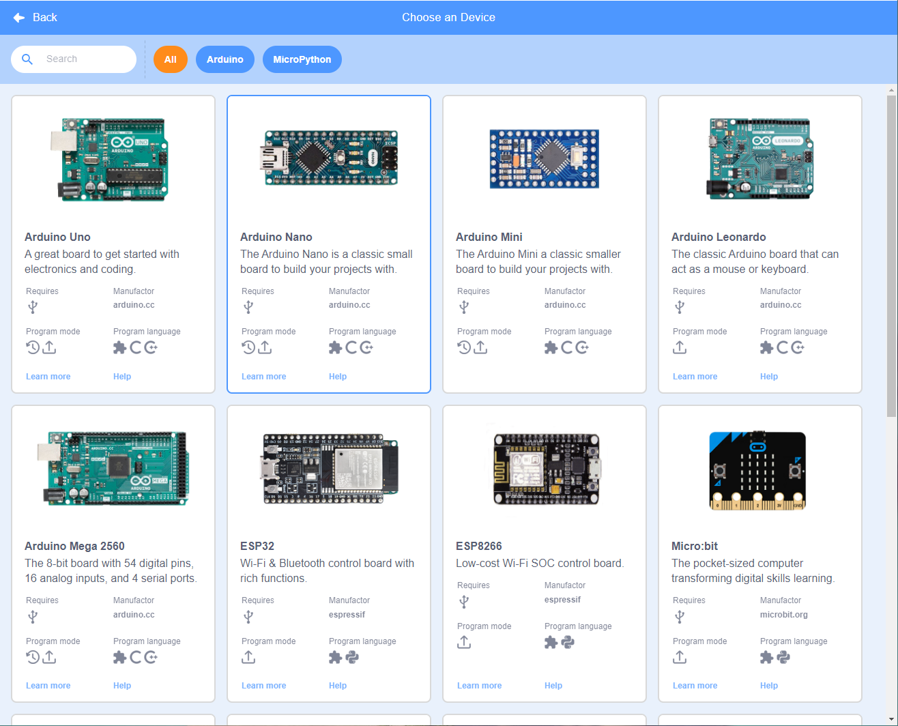

# ircbloq-desktop

IrcBloq as a standalone desktop application.

## Getting Start

Visit the wiki: [https://ircbloqcc.github.io/wiki/main](https://ircbloqcc.github.io/wiki/main)

Visit the wiki on gitee (mirror): [https://ircbloqcc.gitee.io/wiki/main](https://ircbloqcc.gitee.io/wiki/main)

## Join chat

- Gitter: [https://gitter.im/ircbloqcc/community](https://gitter.im/ircbloqcc/community?utm_source=share-link&utm_medium=link&utm_campaign=share-link)

- Chinese QQ group: 933484739

## Bug Report

You can submit the bug log in issues of this project.
